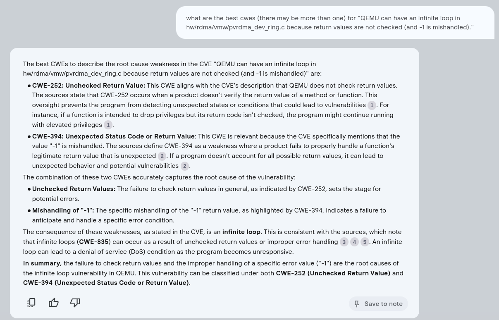
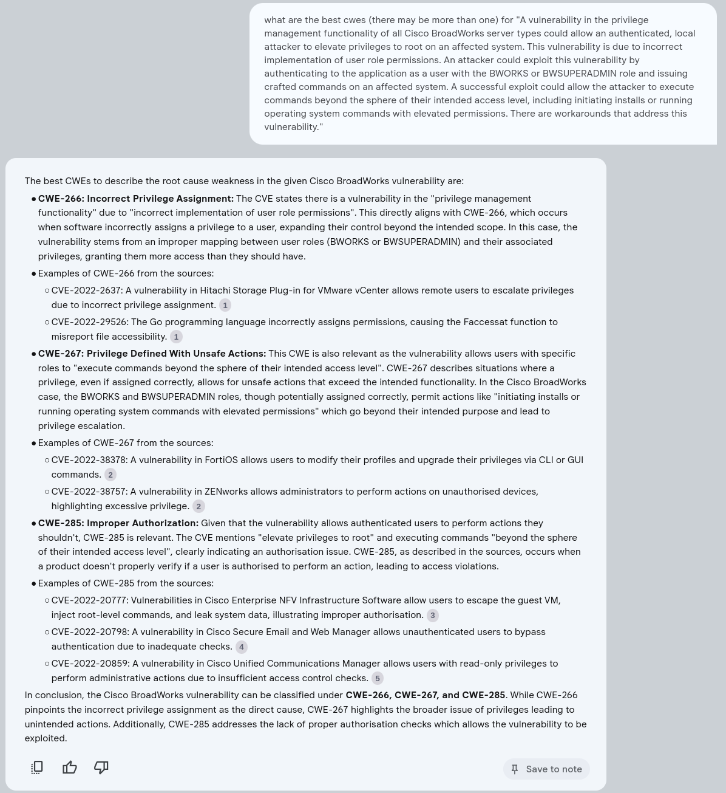
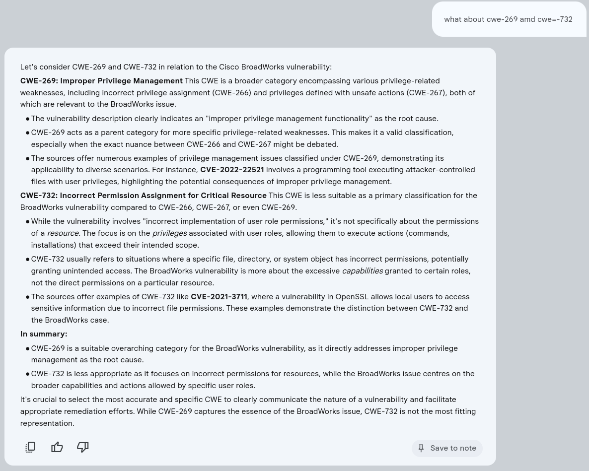
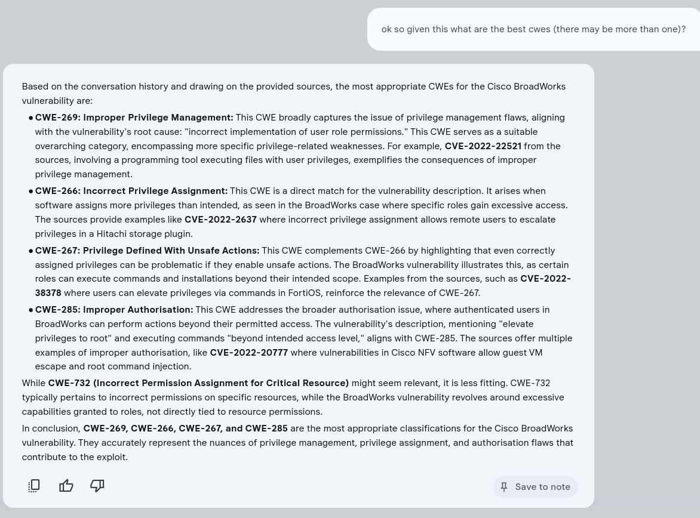

# CVE CWE Assignments

Below are some examples of 

## CVE-2018-20216
https://nvd.nist.gov/vuln/detail/CVE-2018-20216

> QEMU can have an infinite loop in hw/rdma/vmw/pvrdma_dev_ring.c because return values are not checked (and -1 is mishandled).

CWEs assigned in the CVE
- CWE-835	Loop with Unreachable Exit Condition ('Infinite Loop')	cwe source acceptance level NIST  
- CWE-252	Unchecked Return Value	cwe source acceptance level NIST  

> [!NOTE]
> The additional suggested CWE makes sense: CWE-394: Unexpected Status Code or Return Value:

## CVE-2023-20216
https://nvd.nist.gov/vuln/detail/CVE-2023-20216

CWEs assigned in the CVE
- CWE-732	Incorrect Permission Assignment for Critical Resource	cwe source acceptance level NIST  
- CWE-269	Improper Privilege Management	Cisco Systems, Inc. 

> [!NOTE]
> The model provides a rationale for why it thinks
> - CWE-732 is inappropriate
> - CWE-269 and CWE-267 are more appropriate than CWE-266

